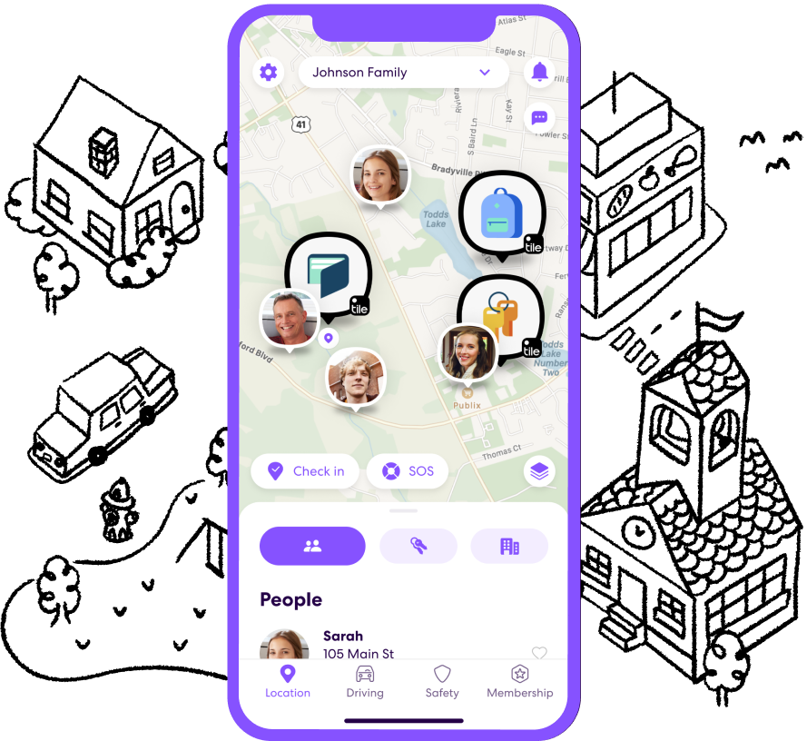

# DH110_yh_2023
Digital Humanity 110 Class Repository

## Sam Huang

## Concept

For now, my project will rely on sharing family members' location and what are the family members are doing. 

The APP I introduced is called Life360.
[Let's go to Life360!](http://app.life360.com)

| Heuristic | Evaluation | Recommendation |
| --------------- | --------------- | --------------- |
| Row 1, Column 1 | Row 1, Column 2 | Row 1, Column 3 |
| Row 2, Column 1 | Row 2, Column 2 | Row 2, Column 3 |
